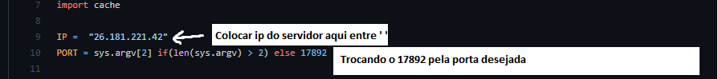
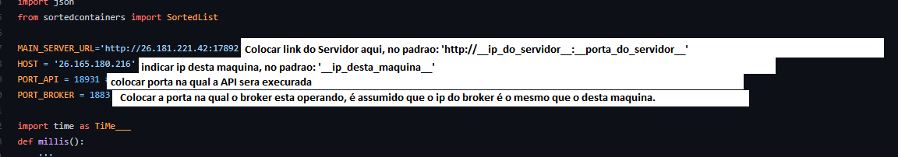
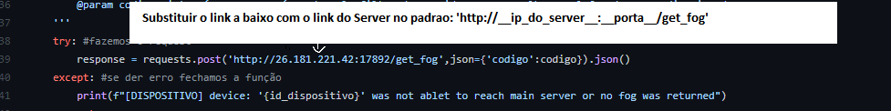

## Descrição ##
Projeto para a 2° PBL da diciplina TEC502 - MI - CONCORRÊNCIA E CONECTIVIDADE. A descrição do problema pode ser vista [aqui]()

Para solução deste problema foi desenvolvido um sistema descentralizado, com a ultilização de micro-sistemas, para possibilitar uma melhor escalabilidade e desempenho. Assim, o sistema é composto de 2 sub-sistemas principais e 1 sub-sistema auxiliar que podem ser executados de forma distribuída, sendo nescessário alterar apenas algumas configurações.

---

## Sistema ##

Como dito, o sistema está dividido em 3 partes: Servidor (ou Servidor Principal), FOG (ou Servidor Intermediario) e Gerador (o que fará a simulação dos dispositivos).
Assim, temos Dispositivos que são simulados no gerador e se comunicam com o Servidor pedindo uma FOG para se conectar, passando a enviar os dados das medições simuladas para esta.
O Servidor principal funciona como uma API que conecta Dispositivos e FOGs, bem como disponibiliza alguns dados, sendo possível requisitar os N pacientes mais graves do sistema.
A Fog é onde os dados são guardados, Dispositivos fazem o envio constante destes dados através do MQTT, e estes são disponibilizados através de uma API, na qual é possível pedir os N pacientes mais graves (presentes nesta FOG) e os dados de um paciente específico.

---

## Configuração ##

Para ultilização deste sistema é nescessário ter o [Python](https://www.python.org/) instalado em todas as máquinas que serão usadas, bem como acesso a um broker MQTT para utilização de cada fog (existe suporte para 2 FOGs no mesmo broker, porém, por requisito de sistema é usado um broker único para cada FOG, assim, os dispositivos se conectariam na FOG mais próxima a eles, assim, cada fog teria um broker próprio), sendo utilizado por nós um servidor MQTT local com o [mosquitto](https://mosquitto.org/).
Também para os testes locais foi usado o [Radmin](https://www.radmin-vpn.com/br/) para simulação de uma rede na qual os testes foram feitos durante o desenvolvimento.
Assim, para configurar o sistema é feito o seguinte passo a passo:

# Iniciar o Servidor #

Para iniciarmos a execução do sistema é executado o sub-sistema do [Servidor](https://github.com/denielfer/pbl-conectvidade-problema2/tree/main/Server) (estando na sua pasta na máquina na qual ele será executado), para tal, precisamos ter um ambiente virtual com os requirements instalados para criarmos um ambiente virtual python com o comando:

			python -m venv env

e em seguida instalamos os requisitos através de:

			python -m pip install -r requirements.txt

por fim precisamos configurar ip e porta no qual a API será executada, para tal, pode ser feito alterando o IP e porta deixados como default no arquivo [API.py](https://github.com/denielfer/pbl-conectvidade-problema2/blob/main/Server/API.py) nas linhas 9 e 10, confome imagem

podendo passar a porta na qual a API será executada como parâmetro conforme de arquivo:

				python API.py __identificador_do_servidor__ __porta_para_API__

no qual '__identificador_do_servidor__' e '__porta_para_API__' são parâmetros opcionais, o primeiro será usado como identificador do servidor (uma string única para indicar este servidor no sistema) e o segundo será usado como a porta na qual a API será executada.

#Iniciar FOG (ou Servidor Intermediario)#

Com o Servidor em funcionamento executamos quantas FOGs forem desejadas, para tal, na máquina que será executada a FOG, iniciamos o MQTT que será usado (caso seja usado um MQTT local), e então na pasta da [FOG](https://github.com/denielfer/pbl-conectvidade-problema2/tree/main/FOG) configuraremos no arquivo [mqtt_handler.py](https://github.com/denielfer/pbl-conectvidade-problema2/blob/main/FOG/mqtt_handler.py) o endereço do Servidor que esta fog se conectará, IP e porta da API e porta do broker (esta solução usa um broker local, então é assumido que o broker está na mesma máquina que esta FOG será executada, logo, o IP da API e o IP do broker são os mesmos) que se encontram nas linhas 7 a 10. Comforme a imagem:

Então, na pasta da [FOG](https://github.com/denielfer/pbl-conectvidade-problema2/tree/main/FOG) vamos criar um ambiente virtual python e instalar os requisitos através de:

			python -m venv env
			python -m pip install -r requirements.txt

Por fim, podemos iniciar o sub-sistema usando:

			python API.py

# Iniciar Gerador #

Para iniciarmos o gerador, é nescessario no arquivo [request_handler.py](https://github.com/denielfer/pbl-conectvidade-problema2/blob/main/Gerador/dispositivo/request_handler.py) na linhas 39 substituir o link presente na request POST pelo link do seu servidor, confome a imagem:

Então, na pasta do [Gerador](https://github.com/denielfer/pbl-conectvidade-problema2/tree/main/Gerador) vamos criar um ambiente virtual python e instalar os requisitos executando:

			python -m venv env
			python -m pip install -r requirements.txt

Por fim, podemos iniciar o sub-sistema usando:

			python manage.py runserver

---

## Observações ##

Para usar o [mosquitto](https://mosquitto.org/) como broker é nescessário usar um arquivo de configuração. Nos arquivos de configuração usados as configurações usadas são:
'''
	auto_id_prefix auto-
	max_inflight_messages 0
	max_keepalive 65535
	max_queued_bytes 0
	max_queued_messages 10000000
	listener __port__ __ip__
	allow_anonymous true
'''
no qual __port__ e __ip__ são substituídos, respectivamente, pela porta na qual o broker estará operando e o IP da máquina na qual o broker está sendo executado.
